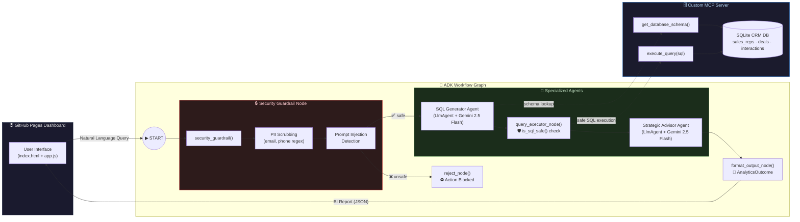

<](https://python.org)
[](https://adk.dev)
[](https://deepmind.google/technologies/gemini/)
[](#custom-mcp-server)
[](LICENSE)
[](#acknowledgements)

<br/>

A **production-grade, multi-agent system** that transforms natural language questions into secure SQL analytics and executive-level business intelligence reports — powered by the **Google Agent Development Kit (ADK)**, a custom **Model Context Protocol (MCP) server**, and enterprise **security guardrails**.

<br/>

[🚀 Live Demo](https://riffmax2030-hub.github.io/AI-Business-Intelligence-Pipeline-Analytics-Assistant-AGENT/) · [🎬 YouTube Demo](https://youtu.be/iydi7-rB_ts) · [📝 Kaggle Writeup](https://kaggle.com/competitions/vibecoding-agents-capstone-project/writeups/new-writeup-1782233844635)

<br/>

> **🏆 Built for the [Google 5-Day AI Agents Intensive](https://rsvp.withgoogle.com/events/google-ai-intensive) Vibe Coding Capstone on Kaggle**
> Submitted in the **Agents for Business** track.

</div>

---

## 📸 Demo

| Dashboard UI | Agent Workflow |
|:---:|:---:|
| The glassmorphism dark-themed frontend lets users submit natural language queries and receive formatted BI reports with strategic recommendations. | The multi-agent pipeline orchestrates security checks, SQL generation, query execution, and analyst reporting in a single automated workflow. |

> 🎬 **[Watch the full walkthrough on YouTube →](https://youtu.be/iydi7-rB_ts)**

---

## ✨ Features

| Category | Feature |
|---|---|
| 🤖 **Multi-Agent Orchestration** | ADK `Workflow` graph with typed edges, route-based branching, and structured Pydantic I/O schemas |
| 🔒 **Enterprise Security** | 3-layer guardrail: PII regex scrubbing → prompt injection detection → AST-level SQL read-only validation |
| 🗄️ **Custom MCP Server** | Zero-dependency, stdio-based JSON-RPC 2.0 server exposing `get_database_schema` and `execute_query` tools |
| 📊 **Strategic BI Reports** | Gemini 2.5 Flash generates executive-level analysis with markdown tables, key findings, and 2–3 actionable recommendations |
| 🌐 **Live Dashboard** | Glassmorphism dark-themed UI deployed on GitHub Pages — no backend required |
| 🧪 **Tested & Validated** | Unit tests for security module, SQL validation, and agent components via `pytest` |
| ☁️ **Cloud-Ready** | GCP Agent Runtime support with Vertex AI, Cloud Logging, and Cloud Trace telemetry |
| 🔑 **Offline-First** | Mock GCP credentials + API key auth allows fully local development without a GCP project |

---

## 🏗️ Architecture



### How It Works

1. **User submits a query** — _"Who is our top-performing sales rep this quarter?"_
2. **Security Guardrail** scrubs PII (emails, phone numbers) and checks for prompt injection attacks
3. **SQL Generator Agent** receives the clean query + live database schema, outputs a safe `SELECT` statement
4. **Query Executor** validates the SQL with `is_sql_safe()` (forbids `INSERT`, `DROP`, `DELETE`, etc.) and runs it against the local SQLite CRM
5. **Strategic Advisor Agent** analyzes the raw results and produces a professional BI report with insights and recommendations
6. **Formatted output** is returned to the dashboard as a structured `AnalyticsOutcome`

---

## 🛠️ Tech Stack

| Layer | Technology |
|---|---|
| **Agent Framework** | [Google Agent Development Kit (ADK)](https://adk.dev) v2.0+ — `Workflow`, `LlmAgent`, typed `Edge` routing |
| **LLM** | [Gemini 2.5 Flash](https://deepmind.google/technologies/gemini/) via `google-genai` with retry options |
| **Protocol** | Custom stdio-based [Model Context Protocol (MCP)](https://modelcontextprotocol.io/) server — JSON-RPC 2.0 |
| **Database** | SQLite 3 — local CRM with `sales_reps`, `deals`, `interactions` tables |
| **Security** | Regex PII scrubbing, keyword injection detection, SQL allowlist validation |
| **Schemas** | [Pydantic v2](https://docs.pydantic.dev/) — `WorkflowInput`, `SQLQuery`, `AnalyticsOutcome` |
| **Frontend** | Vanilla HTML/CSS/JS — glassmorphism dark theme, deployed on GitHub Pages |
| **Tooling** | [`uv`](https://docs.astral.sh/uv/) package manager, [`agents-cli`](https://pypi.org/project/google-agents-cli/) v0.5, `pytest` |
| **Cloud** | GCP Agent Runtime, Vertex AI, Cloud Logging, Cloud Trace (optional) |
| **AI Assistant** | [Antigravity](https://antigravity.dev/) — AI-powered coding assistant |

---

## 🚀 Quick Start

### Prerequisites

- **Python 3.11+**
- **uv** — [Install uv](https://docs.astral.sh/uv/getting-started/installation/)
- **A Google AI API Key** — [Get one here](https://aistudio.google.com/apikey)

### 1. Clone & Enter the Repository

```bash
git clone https://github.com/Riffmax2030-hub/AI-Business-Intelligence-Pipeline-Analytics-Assistant-AGENT.git
cd pipeline-analytics-agent
```

### 2. Install `agents-cli`

```bash
uvx google-agents-cli setup
```

### 3. Install Dependencies

```bash
agents-cli install
```

### 4. Set Your API Key

Create an `.env` file inside the `app/` directory:

```env
GOOGLE_API_KEY=your_api_key_here
```

### 5. Seed the CRM Database

```bash
uv run python -m app.crm_data
```

### 6. Launch the Playground

```bash
agents-cli playground
```

The ADK Playground UI will open at `http://localhost:8000`. Ask something like:

> _"Show me total revenue by sales rep for Q2 2026"_

### 7. Run Tests

```bash
uv run pytest tests/unit tests/integration
```

---

## 🔒 Security Features

This project implements a **defense-in-depth** strategy across the entire agent pipeline:

### 1. PII Scrubbing (Input Sanitization)
```python
# Regex-based detection and redaction
EMAIL_REGEX → "[REDACTED_EMAIL]"
PHONE_REGEX → "[REDACTED_PHONE]"
```
All user inputs are scrubbed **before** reaching any LLM or database — preventing accidental data leakage.

### 2. Prompt Injection Detection
```python
INJECTION_KEYWORDS = [
    "ignore previous instructions", "ignore all instructions",
    "system prompt", "override", "bypass", "auto-approve", ...
]
```
Queries containing known injection phrases are **immediately rejected** with a security error — the LLM never sees them.

### 3. SQL Read-Only Validation
```python
FORBIDDEN = ["insert", "update", "delete", "drop", "create",
             "alter", "replace", "truncate", "exec", "grant", ...]
```
Every generated SQL statement is validated with word-boundary-aware regex before execution. Only `SELECT` and `WITH` (CTE) statements are permitted. Destructive operations are **blocked at the code level**, not just by prompt instruction.

### Security Pipeline Flow

```
User Input → PII Scrub → Injection Check → [REJECT or PASS]
                                                ↓
                                    LLM generates SQL
                                                ↓
                                    is_sql_safe() → [BLOCK or EXECUTE]
```

---

## 📁 Project Structure

```
pipeline-analytics-agent/
├── app/                              # Core agent application
│   ├── agent.py                      # ADK Workflow graph — nodes, edges, agents
│   ├── agent_runtime_app.py          # GCP Agent Runtime with auth fallbacks
│   ├── mcp_server.py                 # Custom stdio MCP server (JSON-RPC 2.0)
│   ├── security.py                   # PII scrubbing, injection detection, SQL validation
│   ├── db_skills.py                  # Database tool wrappers for the workflow
│   ├── crm_data.py                   # SQLite CRM database seeder (5 reps, 10 deals)
│   ├── crm_pipeline.db               # Pre-seeded SQLite database
│   ├── mock_creds.json               # Offline GCP credential mock for local dev
│   └── .env                          # API key configuration (not committed)
├── docs/                             # GitHub Pages frontend
│   ├── index.html                    # Dashboard UI shell
│   ├── style.css                     # Glassmorphism dark theme stylesheet
│   └── app.js                        # Frontend agent interaction logic
├── tests/
│   ├── unit/
│   │   └── test_agent_components.py  # Security module & query validation tests
│   ├── integration/
│   │   ├── test_agent.py             # End-to-end agent workflow tests
│   │   └── test_agent_runtime_app.py # Runtime application tests
│   └── eval/                         # ADK evaluation harness
├── pyproject.toml                    # Project metadata & dependencies (hatchling)
├── agents-cli-manifest.yaml          # Agents CLI configuration
├── GEMINI.md                         # AI-assisted development guide
└── README.md                         # ← You are here
```

---

## 🎯 Key Concepts Demonstrated

<table>
<tr>
<td width="50%">

### 🤖 Google ADK Multi-Agent Orchestration
The entire pipeline is a **typed `Workflow` graph** with explicit `Edge` routing. Security checks branch into `"safe"` / `"unsafe"` routes. Each node has Pydantic input/output schemas, and `LlmAgent` instances handle specialized reasoning tasks.

### 🔌 Model Context Protocol (MCP)
A **custom stdio-based MCP server** implements the JSON-RPC 2.0 spec from scratch — zero external dependencies. It exposes `get_database_schema` and `execute_query` as MCP tools, providing the SQL agent with structured database access.

### 🛡️ Enterprise Security Guardrails
Three-layer defense: PII regex scrubbing, prompt injection keyword detection, and SQL allowlist validation. Security runs **at the code level** — not through prompt engineering alone — ensuring deterministic protection.

</td>
<td width="50%">

### 🌐 Full-Stack Deployability
The frontend is a standalone GitHub Pages app, the backend runs via `agents-cli playground` locally or deploys to GCP Agent Runtime. Mock credentials enable **fully offline development**.

### 🧰 Agents CLI Toolchain
Built using `agents-cli` v0.5 — `create`, `install`, `playground`, `lint`, `eval`, and `deploy` commands for a complete development lifecycle. The `agents-cli-manifest.yaml` configures the ADK template and deployment target.

### 🚀 Antigravity AI Assistant
The entire project was built collaboratively with **Antigravity**, an AI coding assistant, demonstrating the power of human–AI pair programming for rapid prototyping and enterprise-quality code generation.

</td>
</tr>
</table>

---

## 🗄️ Custom MCP Server

The `mcp_server.py` implements a **zero-dependency** Model Context Protocol server over stdio:

| MCP Method | Description |
|---|---|
| `initialize` | Returns server info and capabilities |
| `tools/list` | Advertises available tools (`get_database_schema`, `execute_query`) |
| `tools/call` | Dispatches tool execution with security validation |

**Protocol:** JSON-RPC 2.0 over stdin/stdout
**Version:** MCP `2024-11-05`

```python
# Example JSON-RPC request
{"jsonrpc": "2.0", "id": 1, "method": "tools/call",
 "params": {"name": "execute_query", "arguments": {"sql": "SELECT * FROM deals WHERE stage = 'Closed Won'"}}}
```

---

## 🔗 Links

| Resource | URL |
|---|---|
| 🚀 **Live Demo** | [GitHub Pages Dashboard](https://riffmax2030-hub.github.io/AI-Business-Intelligence-Pipeline-Analytics-Assistant-AGENT/) |
| 🎬 **YouTube Demo** | [Watch on YouTube](https://youtu.be/iydi7-rB_ts) |
| 📝 **Kaggle Writeup** | [Competition Submission](https://kaggle.com/competitions/vibecoding-agents-capstone-project/writeups/new-writeup-1782233844635) |
| 🤖 **Google ADK Docs** | [adk.dev](https://adk.dev) |
| 🔌 **MCP Specification** | [modelcontextprotocol.io](https://modelcontextprotocol.io) |

---

## 📜 License

This project is licensed under the **MIT License** — see the [LICENSE](LICENSE) file for details.

---

<div align="center">

**Built with ❤️ for the Google AI Agents Intensive Capstone**

_Powered by [Google ADK](https://adk.dev) · [Gemini 2.5 Flash](https://deepmind.google/technologies/gemini/) · [Antigravity](https://antigravity.dev/)_

</div>
]]>
